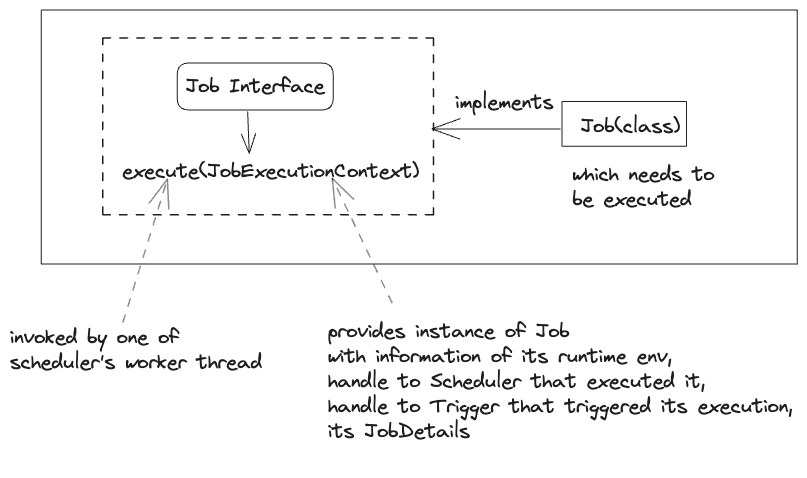

# Quartz Scheduler

* Open source job scheduling library
* It can be used to create simple to complex schedules for executing tens, hundreds, or even ten thousands of jobs
* Jobs - tasks defined as standard Java components that may execute anything we program them to do
* Freely usable and licensed under Apache 2.0 license.


## Key interfaces of the Quartz API :

### Scheduler
A scheduler should be instantiated before it can be used. It's instantiated using the `SchedulerFactory`.
Once the scheduler is instantiated it can be started, put in standby-mode and shutdown. Once shutdown, schedulers
need to be re-instantiated before restarting. Triggers cannot be fired until the scheduler is started or
is in pause mode.
- responsible for managing  runtime environment
- maintains everything required for scheduling jobs, managing listeners, clustering, transactions and job persistence.
- maintains registry of JobDetails, Listeners and Triggers
- executes Job and Listeners when their associated Trigger is fired

#### Scheduler Factory
- factory interface for creating instance of Scheduler based on configured environment
- can be configured via properties, yml or java code


### Job
- interface which is implemented by the class that contains the application code to execute on a trigger is fired.
  


### JobDetail
- Interface implemented by the class which contains the execution-specific information about a job.
- scheduler registers the instance of Triggers with JobDetails.
- When trigger is fired, scheduler picks a thread from thread pool and uses the properties from 
JobDetails to execute the Job on that thread.
- typical properties: job name, job class, job data map, isConcurrentExecutionDisallowed etc.

### JobBuilder
- Builder pattern used to construct instance of JobDetail

### Trigger
- Configuration to decide when/how-long/how-many-times to run a Job.
- Quartz ships with a handful of different trigger types, but the most commonly used types are 
*SimpleTrigger* and *CronTrigger*.
- *SimpleTrigger* is handy if you need ‘one-shot’ execution (just single execution of a job at a 
given moment in time), or if you need to fire a job at a given time, and have it repeat N times, 
with a delay of T between executions.
- *CronTrigger* is useful if you wish to have triggering based on calendar-like schedules -
such as “every Friday, at noon” or “at 10:15 on the 10th day of every month.”

### TriggerBuilder
- builder pattern to create an instance of Trigger

### ThreadPool
- pool of threads reserved by Quartz to run jobs
- When started, the framework initializes a set of worker threads that are used by the Scheduler to execute Jobs

### JobStore
- place where scheduler keeps information about job/trigger etc

### DataSources
- Used when using a JDBCJobSore.

### TriggerListeners
- receive information related to triggers, if configured

### SchedulerListeners
- receive notification of events within scheduler itself, like addition/removal of a job/trigger


# Example

### Configuration :
Ref : [Quartz Scheduler with SpringBoot](https://medium.com/@manvendrapsingh/quartz-scheduling-in-springboot-7cea1b7b19e7)

1.Add dependencies
Gradle Dependencies:
```groovy
    implementation 'org.springframework.boot:spring-boot-starter-quartz'
    // FOR QUARTZ POOL
    // https://mvnrepository.com/artifact/com.mchange/c3p0
    implementation 'com.mchange:c3p0:0.9.5.5'
```

Maven Dependencies:
```xml
 <dependency>
      <groupId>org.springframework.boot</groupId>
      <artifactId>spring-boot-starter-quartz</artifactId>
</dependency>
```
2.Properties

```properties

server.port=9091

spring.jpa.properties.hibernate.dialect = org.hibernate.dialect.PostgreSQLDialect
spring.jpa.hibernate.ddl-auto=update
spring.jpa.hibernate.show-sql=true
spring.datasource.url=jdbc:postgresql://localhost:5432/local_crm
spring.datasource.username=expressuser
spring.datasource.password=password
spring.datasource.driver-class-name=org.postgresql.Driver

#============================================================================
# Configure JobStore - JDBC
#============================================================================
# store type either in-memory or jdbc to store in D
spring.quartz.job-store-type=jdbc
# to create tables used to store job and other scheduling activities
spring.quartz.jdbc.initialize-schema=always

spring.quartz.properties.org.quartz.jobStore.misfireThreshold=1000
spring.quartz.properties.org.quartz.jobStore.useProperties=true
spring.quartz.properties.org.quartz.jobStore.tablePrefix=QRTZ_

spring.quartz.properties.org.quartz.jobStore.class=org.quartz.impl.jdbcjobstore.JobStoreTX
spring.quartz.properties.org.quartz.jobStore.driverDelegateClass=org.quartz.impl.jdbcjobstore.PostgreSQLDelegate

spring.quartz.properties.org.quartz.jobStore.dataSource=quartzDS
spring.quartz.properties.org.quartz.dataSource.quartzDS.URL=jdbc:postgresql://localhost:5432/local_crm
spring.quartz.properties.org.quartz.dataSource.quartzDS.user=expressuser
spring.quartz.properties.org.quartz.dataSource.quartzDS.password=password
spring.quartz.properties.org.quartz.dataSource.quartzDS.driver=org.postgresql.Driver


#============================================================================
# Configure Main Scheduler Properties
#==========================================================================
spring.quartz.properties.org.quartz.scheduler.instanceName=agencyheight
spring.quartz.properties.org.quartz.scheduler.instanceId=AUTO

#============================================================================
# Configure ThreadPool
#============================================================================
spring.quartz.properties.org.quartz.threadPool.class=org.quartz.simpl.SimpleThreadPool
# if you want to provide multiple threads to run jobs
spring.quartz.properties.org.quartz.threadPool.threadCount=1
#spring.quartz.properties.org.quartz.threadPool.threadPriority=5


#============================================================================
# Configure Cluster properties
#============================================================================
spring.quartz.properties.org.quartz.jobStore.isClustered=true

# Frequency (in milliseconds) at which this instance checks-in to cluster.
# Affects the rate of detecting failed instances.
# Defaults to 7500 ms.
spring.quartz.properties.org.quartz.jobStore.clusterCheckinInterval=1000

spring.quartz.properties.org.quartz.scheduler.collectionPrefix=yourCluster

# Time in millis after which a trigger can be considered as expired.
# Defaults to 10 minutes:
spring.quartz.properties.org.quartz.scheduler.triggerTimeoutMillis=1200000

# Time in millis after which a job can be considered as expired.
# Defaults to 10 minutes:
spring.quartz.properties.org.quartz.scheduler.jobTimeoutMillis=1200000

# Time limit in millis after which a trigger should be treated as misfired.
# Defaults to 5000 ms.
spring.quartz.properties.org.quartz.scheduler.misfireThreshold=10000

# When using jdbc job store to avoid lock issues
spring.quartz.properties.org.quartz.jobStore.acquireTriggersWithinLock = true

```

3.Configuration
```java
import java.util.Properties;
import lombok.RequiredArgsConstructor;
import org.quartz.spi.TriggerFiredBundle;
import org.springframework.boot.autoconfigure.quartz.QuartzProperties;
import org.springframework.context.ApplicationContext;
import org.springframework.context.annotation.Bean;
import org.springframework.context.annotation.Configuration;
import org.springframework.scheduling.quartz.SchedulerFactoryBean;
import org.springframework.scheduling.quartz.SpringBeanJobFactory;

@Configuration
@RequiredArgsConstructor
public class SchedulerConfiguration {

  private final QuartzProperties quartzProperties;

  private final ApplicationContext applicationContext;

  private Properties getQuartzProperties() {
    Properties properties = new Properties();
    properties.putAll(quartzProperties.getProperties());

    return properties;
  }

  /**
   * When Spring will use SchedulerFactoryBean to create Scheduler, SchedulerFactoryBean will set
   * this SpringBeanJobFactory in the Scheduler. Then upon each trigger fire, createJobInstance of
   * this SpringBeanJobFactory will be called And we're explicitly weaving the beans from
   * application context. * @return
   */
  @Bean
  public SpringBeanJobFactory createSpringBeanJobFactory() {
    return new SpringBeanJobFactory() {
      @Override
      protected Object createJobInstance(TriggerFiredBundle bundle) throws Exception {
        final Object job = super.createJobInstance(bundle);
        applicationContext.getAutowireCapableBeanFactory().autowireBean(job);
        return job;
      }
    };
  }

  /**
   * we create only SchedulerFactoryBean and spring implicitly uses it to create Scheduler
   *
   * @return SchedulerFactoryBean
   */
  @Bean
  public SchedulerFactoryBean createSchedulerFactoryBean(SpringBeanJobFactory jobFactory) {
    jobFactory.setApplicationContext(applicationContext);

    SchedulerFactoryBean schedulerFactory = new SchedulerFactoryBean();

    schedulerFactory.setQuartzProperties(getQuartzProperties());
    schedulerFactory.setAutoStartup(Boolean.TRUE);
    schedulerFactory.setApplicationContext(applicationContext);
    schedulerFactory.setJobFactory(jobFactory);
    schedulerFactory.setApplicationContextSchedulerContextKey("applicationContext");

    return schedulerFactory;
  }
}
```

4.Job Service

After we have configured our scheduler, we create a service that uses the configured scheduler and 
creates(update, replace and so on) job.

```java
package com.sabu.schedulerquartzpoc.service;

import static org.quartz.JobKey.jobKey;

import com.sabu.schedulerquartzpoc.builder.JobBuilderUtil;
import com.sabu.schedulerquartzpoc.builder.TriggerBuilderUtil;
import com.sabu.schedulerquartzpoc.model.JobDescriptor;
import java.util.Objects;
import java.util.Optional;
import java.util.Set;
import lombok.RequiredArgsConstructor;
import lombok.extern.slf4j.Slf4j;
import org.quartz.JobBuilder;
import org.quartz.JobDataMap;
import org.quartz.JobDetail;
import org.quartz.Scheduler;
import org.quartz.SchedulerException;
import org.quartz.Trigger;
import org.springframework.stereotype.Service;

/**
 * @author : sabu.shakya
 * @created : 2023-06-28
 **/
@Slf4j
@Service
@RequiredArgsConstructor
public class JobService {

  private final Scheduler scheduler;

  private final JobBuilderUtil jobBuilder;

  private final TriggerBuilderUtil triggerBuilder;

  /**
   * @param jobDescriptor CREATES JOB BASED ON JOB DESCRIPTOR AND SCHEDULES AS PER THE TRIGGER
   *     DESCRIPTION
   */
  public void createJob(JobDescriptor jobDescriptor) {

    JobDetail jobDetail = jobBuilder.buildJobDetail(jobDescriptor);

    Set<Trigger> triggers = triggerBuilder.buildTriggers(jobDescriptor);

    try {
      log.info("Scheduling job with key :  {}", jobDetail.getKey());

      scheduler.scheduleJob(jobDetail, triggers, Boolean.FALSE);

      log.info("Job with  key : {} scheduled ", jobDetail.getKey());

    } catch (SchedulerException e) {
      log.error("Could not schedule job with key : {}, error:{}", jobDetail.getKey(),
          e.getLocalizedMessage(), e);
      throw new IllegalArgumentException(e.getLocalizedMessage());
    }

  }
  
  // FOR DETAILS LOOK INTO REPO
  
}

```

5.Create Job

The above jobService can now be used to create jobs. We need to construct the a job class that contains 
that contains the execution code when scheduler triggers the job. 

We will be creating a job that sends a simple text email.

```java
package com.sabu.schedulerquartzpoc.job;

import lombok.RequiredArgsConstructor;
import lombok.extern.slf4j.Slf4j;
import org.quartz.JobDataMap;
import org.quartz.JobExecutionContext;
import org.quartz.JobExecutionException;
import org.springframework.beans.factory.annotation.Value;
import org.springframework.mail.SimpleMailMessage;
import org.springframework.mail.javamail.JavaMailSender;
import org.springframework.stereotype.Service;

/**
 * @author : sabu.shakya
 * @created : 2023-07-06
 **/
@Slf4j
@Service
@RequiredArgsConstructor
public class SendEmail extends AbstractJob {

  @Value("${spring.mail.username}")
  private String email;

  private final JavaMailSender javaMailSender;

  @Override
  public void execute(JobExecutionContext context) throws JobExecutionException {
    this.log(context);

    JobDataMap jobDataMap = this.getJobDataMap(context);

    this.sendEmail(
        (String) jobDataMap.get("toEmail"),
        (String) jobDataMap.get("subject"),
        (String) jobDataMap.get("message"));
  }

  public void sendEmail(String toEmail, String subject, String message) {
    log.info("Preparing to send email to : {} ", toEmail);

    SimpleMailMessage mailMessage = new SimpleMailMessage();
    mailMessage.setTo(toEmail);
    mailMessage.setSubject(subject);
    mailMessage.setText(message);
    mailMessage.setFrom(email);

    javaMailSender.send(mailMessage);

    log.info("Completed sending email.");
  }
}

```
6.Schedule Job
 We can now schedule this job whenever required. For now we'll schedule the email job after  30
seconds of invocation through api.

```java
package com.sabu.schedulerquartzpoc.service;

import static com.sabu.schedulerquartzpoc.constants.JobConstants.EMAIL_JOB;

import com.sabu.schedulerquartzpoc.model.JobDescriptor;
import com.sabu.schedulerquartzpoc.model.MailRequest;
import com.sabu.schedulerquartzpoc.model.TriggerDescriptor;
import java.time.LocalDateTime;
import java.util.Collections;
import java.util.HashMap;
import java.util.Map;
import java.util.UUID;
import lombok.RequiredArgsConstructor;
import org.springframework.stereotype.Service;

@Service
@RequiredArgsConstructor
public class MailService {

  private final JobService jobService;

  public void sendEmail(MailRequest mailRequest) {
    Map<String, Object> data = buildData(mailRequest);

    JobDescriptor jobDescriptor = buildJobDescriptor(data);

    jobService.createJob(jobDescriptor);
  }

  private static JobDescriptor buildJobDescriptor(Map<String, Object> data) {
    JobDescriptor jobDescriptor = new JobDescriptor();

    jobDescriptor.setGroup("email");
    // NEEDS TO BE UNIQUE
    jobDescriptor.setName("mailTo:"+ data.get("toEmail")+ UUID.randomUUID());
    jobDescriptor.setData(data);
    jobDescriptor.setType(EMAIL_JOB);
    jobDescriptor.setDescription("Schedule send email.");

    TriggerDescriptor triggerDescriptor = buildTrigger();

    jobDescriptor.setTriggerDescriptors(Collections.singletonList(triggerDescriptor));

    return jobDescriptor;
  }

  private static TriggerDescriptor buildTrigger() {
    TriggerDescriptor triggerDescriptor = new TriggerDescriptor();
    triggerDescriptor.setFireTime(LocalDateTime.now().plusSeconds(30));
    return triggerDescriptor;
  }

  private static Map<String, Object> buildData(MailRequest mailRequest) {
    Map<String, Object> data = new HashMap<>();

    data.put("toEmail", mailRequest.getToEmail());
    data.put("subject", mailRequest.getSubject());
    data.put("message", mailRequest.getMessage());
    return data;
  }

}

```

```java
package com.sabu.schedulerquartzpoc.controller;

import com.sabu.schedulerquartzpoc.model.MailRequest;
import com.sabu.schedulerquartzpoc.service.MailService;
import javax.validation.Valid;
import lombok.RequiredArgsConstructor;
import org.springframework.http.ResponseEntity;
import org.springframework.web.bind.annotation.PostMapping;
import org.springframework.web.bind.annotation.RequestBody;
import org.springframework.web.bind.annotation.RequestMapping;
import org.springframework.web.bind.annotation.RestController;

@RestController
@RequestMapping("/api/schedule")
@RequiredArgsConstructor
public class MailController {

  private final MailService mailService;

  @PostMapping("/mail")
  public ResponseEntity<?> triggerEmailJob(@RequestBody @Valid MailRequest mailRequest) {
    mailService.sendEmail(mailRequest);
    return ResponseEntity.noContent().build();
  }

}
```

### Configuration for email

*Mail Configuration*
```java
package com.sabu.schedulerquartzpoc.configuration;

import java.util.Properties;
import org.springframework.beans.factory.annotation.Value;
import org.springframework.context.annotation.Bean;
import org.springframework.context.annotation.Configuration;
import org.springframework.mail.javamail.JavaMailSender;
import org.springframework.mail.javamail.JavaMailSenderImpl;

@Configuration
public class MailConfiguration {

  @Value("${spring.mail.username}")
  private String email;

  @Value("${spring.mail.password}")
  private String password;

  @Bean
  public JavaMailSender getJavaMailSender() {
    JavaMailSenderImpl mailSender = new JavaMailSenderImpl();
    mailSender.setHost("smtp.gmail.com");
    mailSender.setPort(587);

    mailSender.setUsername(email);
    mailSender.setPassword(password);

    Properties props = mailSender.getJavaMailProperties();
    props.put("mail.transport.protocol", "smtp");
    props.put("mail.smtp.auth", "true");
    props.put("mail.smtp.starttls.enable", "true");
    props.put("mail.debug", "true");

    return mailSender;
  }

}

```

Add these to properties file:
```properties
spring.mail.host=smtp.gmail.com
spring.mail.port=587
spring.mail.username=your@email.com
spring.mail.password=password
spring.mail.properties.mail.smtp.auth=true
spring.mail.properties.mail.smtp.starttls.enable=true
```

References: 
- https://www.linkedin.com/pulse/working-quartz-scheduler-using-spring-boot-shubham-wankhede/


