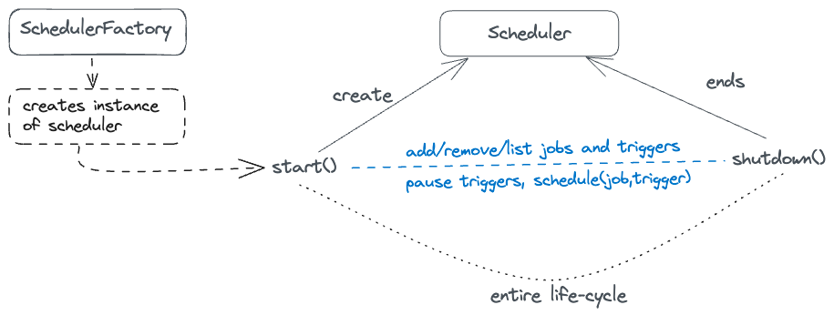

# Quartz Scheduler

* Open source job scheduling library
* It can be used to create simple to complex schedules for executing tens, hundreds, or even ten thousands of jobs
* Jobs - tasks defined as standard Java components that may execute anything we program them to do
* Freely usable and licensed under Apache 2.0 license.


## Key interfaces of the Quartz API :

### Scheduler
A scheduler should be instantiated before it can be used. It's instantiated using the `SchedulerFactory`.
Once the scheduler is instantiated it can be started, put in standby-mode and shutdown. Once shutdown, schedulers
need to be re-instantiated before restarting. Triggers cannot be fired until the scheduler is started or
is in pause mode.
- responsible for managing  runtime environment
- maintains everything required for scheduling jobs, managing listeners, clustering, transactions and job persistence.
- maintains registry of JobDetails, Listeners and Triggers
- executes Job and Listeners when their associated Trigger is fired

#### Scheduler Factory
- factory interface for creating instance of Scheduler based on configured environment
- can be configured via properties, yml or java code



### Job
- interface which is implemented by the class that contains the application code to execute on a trigger is fired.
  


### JobDetail
- Interface implemented by the class which contains the execution-specific information about a job.
- scheduler registers the instance of Triggers with JobDetails.
- When trigger is fired, scheduler picks a thread from thread pool and uses the properties from 
JobDetails to execute the Job on that thread.
- typical properties: job name, job class, job data map, isConcurrentExecutionDisallowed etc.

### JobBuilder
- Builder pattern used to construct instance of JobDetail

### Trigger
- Configuration to decide when/how-long/how-many-times to run a Job.
- Quartz ships with a handful of different trigger types, but the most commonly used types are 
*SimpleTrigger* and *CronTrigger*.
- *SimpleTrigger* is handy if you need ‘one-shot’ execution (just single execution of a job at a 
given moment in time), or if you need to fire a job at a given time, and have it repeat N times, 
with a delay of T between executions.
- *CronTrigger* is useful if you wish to have triggering based on calendar-like schedules -
such as “every Friday, at noon” or “at 10:15 on the 10th day of every month.”

### TriggerBuilder
- builder pattern to create an instance of Trigger

### ThreadPool
- pool of threads reserved by Quartz to run jobs
- When started, the framework initializes a set of worker threads that are used by the Scheduler to execute Jobs

### JobStore
- place where scheduler keeps information about job/trigger etc

### DataSources
- Used when using a JDBCJobSore.

### TriggerListeners
- receive information related to triggers, if configured

### SchedulerListeners
- receive notification of events within scheduler itself, like addition/removal of a job/trigger


# Example

### Configuration :
Ref : [Quartz Scheduler with SpringBoot](https://medium.com/@manvendrapsingh/quartz-scheduling-in-springboot-7cea1b7b19e7)

1.Add dependencies
Gradle Dependencies:
```groovy
    implementation 'org.springframework.boot:spring-boot-starter-quartz'
    // FOR QUARTZ POOL
    // https://mvnrepository.com/artifact/com.mchange/c3p0
    implementation 'com.mchange:c3p0:0.9.5.5'
```

Maven Dependencies:
```xml
 <dependency>
      <groupId>org.springframework.boot</groupId>
      <artifactId>spring-boot-starter-quartz</artifactId>
</dependency>
```
2.Properties

```properties

server.port=9091

spring.jpa.properties.hibernate.dialect = org.hibernate.dialect.PostgreSQLDialect
spring.jpa.hibernate.ddl-auto=update
spring.jpa.hibernate.show-sql=true
spring.datasource.url=jdbc:postgresql://localhost:5432/local_crm
spring.datasource.username=expressuser
spring.datasource.password=password
spring.datasource.driver-class-name=org.postgresql.Driver

#============================================================================
# Configure JobStore - JDBC
#============================================================================
# store type either in-memory or jdbc to store in D
spring.quartz.job-store-type=jdbc
# to create tables used to store job and other scheduling activities
spring.quartz.jdbc.initialize-schema=always

spring.quartz.properties.org.quartz.jobStore.misfireThreshold=1000
spring.quartz.properties.org.quartz.jobStore.useProperties=true
spring.quartz.properties.org.quartz.jobStore.tablePrefix=QRTZ_

spring.quartz.properties.org.quartz.jobStore.class=org.quartz.impl.jdbcjobstore.JobStoreTX
spring.quartz.properties.org.quartz.jobStore.driverDelegateClass=org.quartz.impl.jdbcjobstore.PostgreSQLDelegate

spring.quartz.properties.org.quartz.jobStore.dataSource=quartzDS
spring.quartz.properties.org.quartz.dataSource.quartzDS.URL=jdbc:postgresql://localhost:5432/local_crm
spring.quartz.properties.org.quartz.dataSource.quartzDS.user=expressuser
spring.quartz.properties.org.quartz.dataSource.quartzDS.password=password
spring.quartz.properties.org.quartz.dataSource.quartzDS.driver=org.postgresql.Driver


#============================================================================
# Configure Main Scheduler Properties
#==========================================================================
spring.quartz.properties.org.quartz.scheduler.instanceName=agencyheight
spring.quartz.properties.org.quartz.scheduler.instanceId=AUTO

#============================================================================
# Configure ThreadPool
#============================================================================
spring.quartz.properties.org.quartz.threadPool.class=org.quartz.simpl.SimpleThreadPool
# if you want to provide multiple threads to run jobs
spring.quartz.properties.org.quartz.threadPool.threadCount=1
#spring.quartz.properties.org.quartz.threadPool.threadPriority=5


#============================================================================
# Configure Cluster properties
#============================================================================
spring.quartz.properties.org.quartz.jobStore.isClustered=true

# Frequency (in milliseconds) at which this instance checks-in to cluster.
# Affects the rate of detecting failed instances.
# Defaults to 7500 ms.
spring.quartz.properties.org.quartz.jobStore.clusterCheckinInterval=1000

spring.quartz.properties.org.quartz.scheduler.collectionPrefix=yourCluster

# Time in millis after which a trigger can be considered as expired.
# Defaults to 10 minutes:
spring.quartz.properties.org.quartz.scheduler.triggerTimeoutMillis=1200000

# Time in millis after which a job can be considered as expired.
# Defaults to 10 minutes:
spring.quartz.properties.org.quartz.scheduler.jobTimeoutMillis=1200000

# Time limit in millis after which a trigger should be treated as misfired.
# Defaults to 5000 ms.
spring.quartz.properties.org.quartz.scheduler.misfireThreshold=10000

```

3.Configuration
```java


```

References: 
- https://www.linkedin.com/pulse/working-quartz-scheduler-using-spring-boot-shubham-wankhede/


